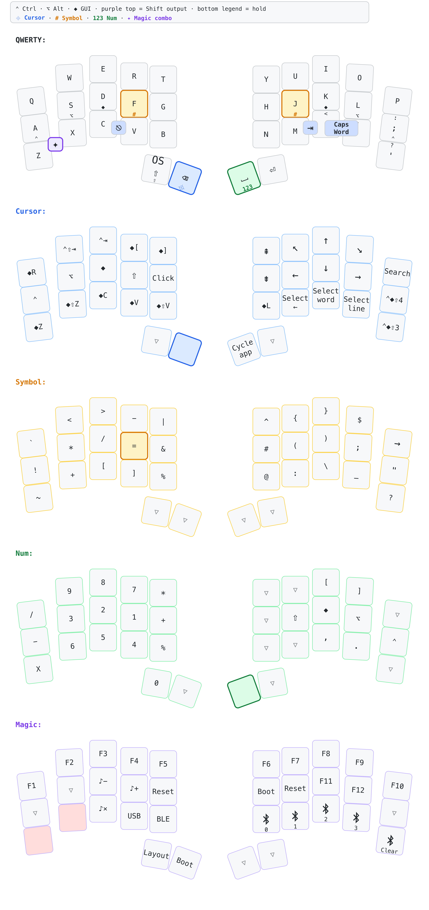
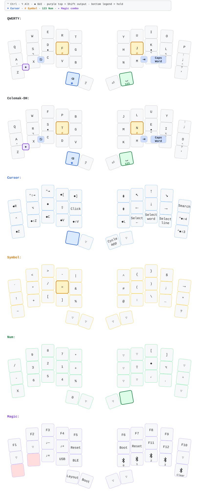

[Download the SVG version](keymap-drawer/keymap-compact.svg).

# ZMK Configuration for DokoDemo

This repository contains the DokoDemo firmware and a 34-key layout derived from
the companion Voyager QMK and Go60 ZMK keymaps. QWERTY is the default base;
Colemak-DH is a complete alternate base toggled from the Magic layer.

Highlights:

- Go60-style bilateral home-row behaviors: 280 ms tapping term, 125 ms quick
  tap, opposite-hand triggers, and per-finger prior-idle timing;
- `F`/`J` on QWERTY and `T`/`N` on Colemak-DH hold the Symbol layer;
- Backspace/Cursor, dedicated Shift, Enter, and Space/Num thumb keys;
- `Q+W` Tab and `Z+X` momentary Magic combos using a 35 ms timeout, plus
  `A+S` Escape and `O+P` Caps Word at 25 ms; all require 100 ms prior idle;
- a symbol-only Symbol layer, transparent unused Num positions, and no Cursor
  or Num locks;
- a base apostrophe key whose shifted output is `?`; and
- per-half boot/reset controls plus output and Bluetooth selection on Magic.

## Detailed keymap



Regenerate the parsed keymap and SVG with:

## Re-building the keymap

```sh
make keymap
```

This also creates `keymap-drawer/keymap-compact.svg`, a summary containing the
QWERTY and four functional layers. Run `make keymap-compact` when you only need
to refresh that shareable summary.

Create the tracked 3840px PNG used above with:

```sh
make keymap-compact-png
```

This optional export target requires `rsvg-convert` from librsvg. Override its
path with `RSVG_CONVERT=/path/to/rsvg-convert` when needed.

This uses the globally installed `keymap` executable. Saving
`keymap-drawer/keymap.yaml` in VS Code also redraws the SVG when the recommended
Run on Save extension is installed.

Create a three-page, print-ready A4 PDF with:

```sh
make keymap-print
```

The PDF is written to `keymap-drawer/keymap-print.pdf`. This target requires GNU
Make, the global `keymap` executable, Python 3 with PyYAML, and Chromium. Set
`CHROMIUM=/path/to/browser` if the executable has a different name.
